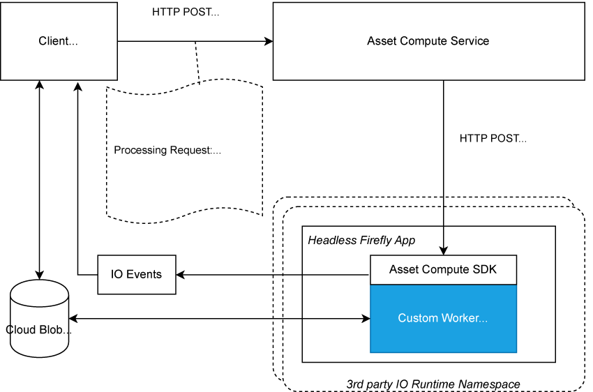

# 自訂應用程式的內部檔案{#how-custom-application-works}

使用下圖可瞭解當客戶使用自訂應用程式處理數位資產時，端對端工作流程。



*圖：使用處理資產所涉及的步驟 [!DNL Asset Compute Service]。*

## 註冊{#registration}

客戶在第一次要求[`/register`](api.md#register)之前必須呼叫[`/process`](api.md#process-request)一次，才能設定並擷取日誌URL，以便接收Adobe Asset Compute的Adobe I/O Events。

```sh
curl -X POST \
  https://asset-compute.adobe.io/register \
  -H "x-ims-org-id: $ORG_ID" \
  -H "x-gw-ims-org-id: $ORG_ID" \
  -H "Authorization: Bearer $JWT_TOKEN" \
  -H "x-api-key: $API_KEY"
```

[`@adobe/asset-compute-client`](https://github.com/adobe/asset-compute-client#usage) JavaScript程式庫可用於NodeJS應用程式，以處理從註冊、處理到非同步事件處理等所有必要步驟。 有關所需標頭的詳細資訊，請參閱[驗證和授權](api.md)。

## 處理 {#processing}

客戶端發送[處理](api.md#process-request)請求。

```sh
curl -X POST \
  https://asset-compute.adobe.io/process \
  -H "x-ims-org-id: $ORG_ID" \
  -H "x-gw-ims-org-id: $ORG_ID" \
  -H "Authorization: Bearer $JWT_TOKEN" \
  -H "x-api-key: $API_KEY" \
  -d "<RENDITION_JSON>
```

用戶端負責使用預先簽名的URL正確格式化轉譯。 [`@adobe/node-cloud-blobstore-wrapper`](https://github.com/adobe/node-cloud-blobstore-wrapper#presigned-urls) JavaScript程式庫可用於NodeJS應用程式中，以預先簽署URL。 目前，該庫僅支援Azure Blob儲存和AWS S3容器。

處理請求會傳回`requestId`，該&lt;a0/>可用於輪詢Adobe I/O事件。

以下是自訂應用程式處理要求的範例。

```json
{
    "source": "https://www.adobe.com/some-source-file.jpg",
    "renditions" : [
        {
            "worker": "https://my-project-namespace.adobeioruntime.net/api/v1/web/my-namespace-version/my-worker",
            "name": "rendition1.jpg",
            "target": "https://some-presigned-put-url-for-rendition1.jpg",
        }
    ],
    "userData": {
        "my-asset-id": "1234567890"
    }
}
```

[!DNL Asset Compute Service]會將自訂應用程式轉譯請求傳送至自訂應用程式。 它會將HTTP POST用於提供的應用程式URL，此應用程式URL是來自Project Firefly的安全網頁動作URL。 所有請求都使用HTTPS通訊協定，以最大化資料安全性。

自訂應用程式使用的[資產計算SDK](https://github.com/adobe/asset-compute-sdk#adobe-asset-compute-worker-sdk)可處理HTTP POST要求。 此外，它還可處理來源的下載、上傳轉譯、傳送I/O事件和錯誤處理。

<!-- TBD: Add the application diagram. -->

### 應用程式碼{#application-code}

自訂程式碼只需要提供回呼，以取用本機可用的原始檔(`source.path`)。 `rendition.path`是放置資產處理請求最終結果的位置。 自訂應用程式使用回呼，使用傳入的名稱(`rendition.path`)，將本機可用的來源檔案轉換為轉譯檔案。 自訂應用程式必須寫入`rendition.path`才能建立轉譯：

```javascript
const { worker } = require('@adobe/asset-compute-sdk');
const fs = require('fs').promises;

// worker() is the entry point in the SDK "framework".
// The asynchronous function defined is the rendition callback.
exports.main = worker(async (source, rendition) => {

    // Tip: custom worker parameters are available in rendition.instructions.
    console.log(rendition.instructions.name); // should print out `rendition.jpg`.

    // Simplest example: copy the source file to the rendition file destination so as to transfer the asset as is without processing.
    await fs.copyFile(source.path, rendition.path);
});
```

### 下載來源檔案{#download-source}

自訂應用程式只處理本機檔案。 下載來源檔案由[資產計算SDK](https://github.com/adobe/asset-compute-sdk#adobe-asset-compute-worker-sdk)處理。

### 格式副本建立{#rendition-creation}

SDK會針對每個轉譯呼叫非同步[轉譯回呼函式](https://github.com/adobe/asset-compute-sdk#rendition-callback-for-worker-required)。

回呼函式可存取[source](https://github.com/adobe/asset-compute-sdk#source)和[rendition](https://github.com/adobe/asset-compute-sdk#rendition)物件。 `source.path`已存在，是源檔案的本地副本的路徑。 `rendition.path`是必須儲存已處理轉譯的路徑。 除非已設定[disableSourceDownload標幟](https://github.com/adobe/asset-compute-sdk#worker-options-optional)，否則應用程式必須完全使用`rendition.path`。 否則，SDK無法找到或識別轉譯檔案，並會失敗。

本範例的過度簡化是為了說明並著重於自訂應用程式的剖析。 應用程式只會將來源檔案複製到轉譯目的地。

如需轉譯回呼參數的詳細資訊，請參閱[資產計算SDK API](https://github.com/adobe/asset-compute-sdk#api-details)。

### 上傳轉譯{#upload-rendition}

在以`rendition.path`提供的路徑建立每個轉譯並儲存在檔案中後，[Asset Compute SDK](https://github.com/adobe/asset-compute-sdk#adobe-asset-compute-worker-sdk)會將每個轉譯上傳至雲端儲存空間（AWS或Azure）。 如果且僅當傳入的請求具有指向相同應用程式URL的多個轉譯時，自訂應用程式會同時取得多個轉譯。 上傳至雲端儲存空間是在每個轉譯之後，以及在執行下一個轉譯的回呼之前完成。

`batchWorker()`的行為不同，因為它實際上會處理所有轉譯，而且只有在所有轉譯都經過處理後，才會上傳這些轉譯。

## Adobe I/O事件{#aio-events}

SDK會針對每個轉譯傳送Adobe I/O事件。 這些事件的類型為`rendition_created`或`rendition_failed`，視結果而定。 如需事件詳細資訊，請參閱[資產計算非同步事件](api.md#asynchronous-events)。

## 接收Adobe I/O事件{#receive-aio-events}

用戶端會根據其使用邏輯輪詢[Adobe I/O Events Journal](https://www.adobe.io/apis/experienceplatform/events/ioeventsapi.html#/Journaling)。 初始日誌URL是`/register` API響應中提供的日誌URL。 事件可以使用`requestId`來識別，該&lt;a0/>存在於事件中，與在`/process`中傳回的事件相同。 每個轉譯都有個別事件，當轉譯上傳（或失敗）後，就會立即傳送。 當用戶端收到相符的事件後，就可顯示或處理產生的轉譯。

JavaScript程式庫[`asset-compute-client`](https://github.com/adobe/asset-compute-client#usage)使用`waitActivation()`方法，讓日誌輪詢變得簡單，以取得所有事件。

```javascript
const events = await assetCompute.waitActivation(requestId);
await Promise.all(events.map(event => {
    if (event.type === "rendition_created") {
        // get rendition from cloud storage location
    }
    else if (event.type === "rendition_failed") {
        // failed to process
    }
    else {
        // other event types
        // (could be added in the future)
    }
}));
```

如需如何取得日記賬事件的詳細資訊，請參閱[Adobe I/O Events API](https://www.adobe.io/apis/experienceplatform/events/ioeventsapi.html#!adobedocs/adobeio-events/master/events-api-reference.yaml)。

<!-- TBD:
* Illustration of the controls/data flow.
* Basic overview, in text and not code, of how an application works.
-->
