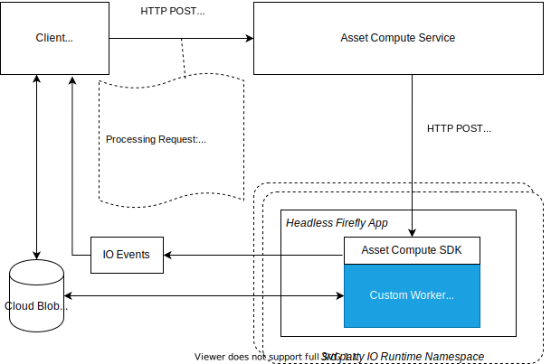

# 自訂應用程式的內部結構 {#how-custom-application-works}

使用下圖來瞭解當使用者端使用自訂應用程式處理數位資產時的端對端工作流程。



*圖：處理資產的相關步驟，使用 [!DNL Asset Compute Service].*

## 註冊 {#registration}

使用者端必須呼叫 [`/register`](api.md#register) 在第一次向提出請求之前一次 [`/process`](api.md#process-request) 以設定和擷取分錄URL進行接收 [!DNL Adobe I/O] AdobeAsset compute事件。

```sh
curl -X POST \
  https://asset-compute.adobe.io/register \
  -H "x-ims-org-id: $ORG_ID" \
  -H "x-gw-ims-org-id: $ORG_ID" \
  -H "Authorization: Bearer $JWT_TOKEN" \
  -H "x-api-key: $API_KEY"
```

此 [`@adobe/asset-compute-client`](https://github.com/adobe/asset-compute-client#usage) JavaScript程式庫可用於NodeJS應用程式，以處理從註冊、處理到非同步事件處理的所有必要步驟。 如需必要標題的詳細資訊，請參閱 [驗證與授權](api.md).

## 處理 {#processing}

使用者端傳送 [處理](api.md#process-request) 要求。

```sh
curl -X POST \
  https://asset-compute.adobe.io/process \
  -H "x-ims-org-id: $ORG_ID" \
  -H "x-gw-ims-org-id: $ORG_ID" \
  -H "Authorization: Bearer $JWT_TOKEN" \
  -H "x-api-key: $API_KEY" \
  -d "<RENDITION_JSON>
```

使用者端負責使用預先簽署的URL正確格式化轉譯。 此 [`@adobe/node-cloud-blobstore-wrapper`](https://github.com/adobe/node-cloud-blobstore-wrapper#presigned-urls) JavaScript程式庫可用於NodeJS應用程式，以預先簽署URL。 目前程式庫僅支援Azure Blob儲存體和AWS S3容器。

處理要求傳回 `requestId` 可用於輪詢的 [!DNL Adobe I/O] 事件。

以下為範例自訂應用程式處理請求。

```json
{
    "source": "https://www.adobe.com/some-source-file.jpg",
    "renditions" : [
        {
            "worker": "https://my-project-namespace.adobeioruntime.net/api/v1/web/my-namespace-version/my-worker",
            "name": "rendition1.jpg",
            "target": "https://some-presigned-put-url-for-rendition1.jpg",
        }
    ],
    "userData": {
        "my-asset-id": "1234567890"
    }
}
```

此 [!DNL Asset Compute Service] 傳送自訂應用程式轉譯請求給自訂應用程式。 它會使用HTTPPOST來連線提供的應用程式URL，這是來自App Builder的安全網路動作URL。 所有要求都使用HTTPS通訊協定，以最大化資料安全性。

此 [ASSET COMPUTESDK](https://github.com/adobe/asset-compute-sdk#adobe-asset-compute-worker-sdk) 由自訂應用程式使用，處理HTTPPOST請求。 它也會處理來源下載、上傳轉譯、傳送 [!DNL Adobe I/O] 事件和錯誤處理。

<!-- TBD: Add the application diagram. -->

### 應用程式程式碼 {#application-code}

自訂程式碼只需提供回呼，接受本機可用的來源檔案(`source.path`)。 此 `rendition.path` 是放置資產處理請求最終結果的位置。 自訂應用程式會使用回呼，使用傳入的名稱將本機可用的來源檔案轉換為轉譯檔案(`rendition.path`)。 自訂應用程式必須寫入 `rendition.path` 若要建立轉譯：

```javascript
const { worker } = require('@adobe/asset-compute-sdk');
const fs = require('fs').promises;

// worker() is the entry point in the SDK "framework".
// The asynchronous function defined is the rendition callback.
exports.main = worker(async (source, rendition) => {

    // Tip: custom worker parameters are available in rendition.instructions.
    console.log(rendition.instructions.name); // should print out `rendition.jpg`.

    // Simplest example: copy the source file to the rendition file destination so as to transfer the asset as is without processing.
    await fs.copyFile(source.path, rendition.path);
});
```

### 下載來源檔案 {#download-source}

自訂應用程式只會處理本機檔案。 下載來源檔案的處理方式 [ASSET COMPUTESDK](https://github.com/adobe/asset-compute-sdk#adobe-asset-compute-worker-sdk).

### 建立轉譯 {#rendition-creation}

SDK會以非同步方式呼叫 [轉譯回呼函式](https://github.com/adobe/asset-compute-sdk#rendition-callback-for-worker-required) 每個轉譯。

回呼函式可以存取 [source](https://github.com/adobe/asset-compute-sdk#source) 和 [轉譯](https://github.com/adobe/asset-compute-sdk#rendition) 物件。 此 `source.path` 已存在，且是來源檔案的本機副本路徑。 此 `rendition.path` 是必須儲存已處理轉譯的路徑。 除非 [disableSourceDownload旗標](https://github.com/adobe/asset-compute-sdk#worker-options-optional) 設定，應用程式必須完全使用 `rendition.path`. 否則，SDK將無法找到或識別轉譯檔案，並會失敗。

範例的過度簡化是為了說明和專注於自訂應用程式的剖析。 應用程式只會將來源檔案複製到轉譯目的地。

如需有關轉譯回呼引數的詳細資訊，請參閱 [ASSET COMPUTE SDK API](https://github.com/adobe/asset-compute-sdk#api-details).

### 上傳轉譯 {#upload-rendition}

建立每個轉譯並儲存在檔案後，其路徑由 `rendition.path`，則 [ASSET COMPUTESDK](https://github.com/adobe/asset-compute-sdk#adobe-asset-compute-worker-sdk) 將每個轉譯上傳至雲端儲存空間(AWS或Azure)。 若且唯若傳入請求具有多個指向相同應用程式URL的轉譯時，自訂應用程式會同時取得多個轉譯。 上傳至雲端儲存空間會在每個轉譯之後以及執行下一個轉譯的回呼之前完成。

此 `batchWorker()` 有不同的行為，因為它實際上會處理所有轉譯，而且只會在所有轉譯都處理完成之後才會上傳這些轉譯。

## [!DNL Adobe I/O] 事件 {#aio-events}

SDK會傳送 [!DNL Adobe I/O] 每個轉譯的事件。 這些事件為其中一種型別 `rendition_created` 或 `rendition_failed` 視結果而定。 另請參閱 [asset compute非同步事件](api.md#asynchronous-events) 以取得事件詳細資訊。

## 接收 [!DNL Adobe I/O] 事件 {#receive-aio-events}

使用者端輪詢 [[!DNL Adobe I/O] 事件日誌](https://www.adobe.io/apis/experienceplatform/events/ioeventsapi.html#/Journaling) 根據其消耗邏輯。 初始日誌URL是提供的日誌URL `/register` API回應。 事件可透過以下方式識別： `requestId` 會顯示在事件中，且與中傳回的值相同。 `/process`. 每個轉譯都有個別事件，會在轉譯上傳（或失敗）後立即傳送。 使用者端收到相符事件後，即可顯示或處理產生的轉譯。

JavaScript資料庫 [`asset-compute-client`](https://github.com/adobe/asset-compute-client#usage) 使用讓日誌輪詢更簡單 `waitActivation()` 方法以取得所有事件。

```javascript
const events = await assetCompute.waitActivation(requestId);
await Promise.all(events.map(event => {
    if (event.type === "rendition_created") {
        // get rendition from cloud storage location
    }
    else if (event.type === "rendition_failed") {
        // failed to process
    }
    else {
        // other event types
        // (could be added in the future)
    }
}));
```

如需有關如何取得日誌事件的詳細資訊，請參閱 [[!DNL Adobe I/O] 事件API](https://www.adobe.io/apis/experienceplatform/events/ioeventsapi.html#!adobedocs/adobeio-events/master/events-api-reference.yaml).

<!-- TBD:
* Illustration of the controls/data flow.
* Basic overview, in text and not code, of how an application works.
-->
